# Dissolve Adjacent by Expression

Algoritmo Processing per QGIS che dissolve poligoni adiacenti basandosi su un'espressione e genera layer lineari dai bordi.

## Installazione

1. Apri QGIS
2. Vai su **Processing** → **Toolbox**
3. Clicca sull'icona **Python** (serpente)
4. Seleziona **Add Script to Toolbox...**
5. Seleziona il file `dissolve_adjacent_by_expression.py`

Lo script apparirà in **Scripts** → **Vector geometry** → **Dissolve Adjacent by Expression**

## Come Funziona

### Flusso di Elaborazione

```mermaid
flowchart TD
    Start([📥 Input Layer<br/>Poligoni con attributo note])
    
    Filter{🔍 Filtro Prefissi<br/>attivo?}
    FilterApply[✂️ Filtra per prefissi<br/>CEC, PdCC, PdC, etc.]
    
    Dissolve[🔗 Dissolve Poligonale<br/>Per espressione + adiacenza<br/>Concatena valori note]
    
    MultiToSingle[📦 Multipart → Singlepart<br/>Assegna ID univoci]
    
    PolyToLine[📐 Poligoni → Linee<br/>Estrai boundary]
    
    Explode[💥 Esplodi in Segmenti<br/>Linee → segmenti individuali]
    
    RemoveDup[🧹 Elimina Duplicati<br/>Con gestione eccezioni<br/>XOR logic]
    
    LineMerge[🔄 Dissolve Lineare<br/>LineMerge per note+nro+id]
    
    Out1[📄 Filtered Polygons<br/>opzionale]
    Out2[📄 Dissolved Polygons<br/>note, nro, id]
    Out3[📄 Lines without Duplicates<br/>segmenti unici]
    Out4[📄 Lines Dissolved<br/>linee unite]
    
    Start --> Filter
    Filter -->|Sì| FilterApply
    Filter -->|No| Dissolve
    FilterApply --> Out1
    FilterApply --> Dissolve
    
    Dissolve --> MultiToSingle
    MultiToSingle --> Out2
    MultiToSingle --> PolyToLine
    
    PolyToLine --> Explode
    Explode --> RemoveDup
    RemoveDup --> Out3
    RemoveDup --> LineMerge
    LineMerge --> Out4
    
    style Start fill:#4A90E2,stroke:#2E5C8A,stroke-width:3px,color:#fff
    style Filter fill:#FFA726,stroke:#F57C00,stroke-width:2px
    style Out1 fill:#7CB342,stroke:#558B2F,stroke-width:2px,color:#fff
    style Out2 fill:#7CB342,stroke:#558B2F,stroke-width:2px,color:#fff
    style Out3 fill:#7CB342,stroke:#558B2F,stroke-width:2px,color:#fff
    style Out4 fill:#7CB342,stroke:#558B2F,stroke-width:2px,color:#fff
    style Dissolve fill:#5FA3D0,stroke:#2E5C8A,stroke-width:2px
    style RemoveDup fill:#E57373,stroke:#C62828,stroke-width:2px,color:#fff
```



----

```
Input Layer
    ↓
1. Filtro Prefissi (opzionale)
    ↓
2. Dissolve Poligonale (per espressione + adiacenza)
    ↓
3. Conversione Multipart → Singlepart
    ↓
4. Poligoni → Linee (boundary)
    ↓
5. Esplodi Linee in Segmenti
    ↓
6. Elimina Duplicati Geometrici (con eccezioni)
    ↓
7. Dissolve Lineare (linemerge per attributi)
    ↓
Output: 4 layer
```

### Logica Dissolve Poligonale

I poligoni vengono dissolti insieme **SOLO** se:
- Hanno lo **stesso valore** dell'espressione applicata all'attributo "note"
- Sono **geometricamente adiacenti** (condividono un confine)

I valori "note" dei poligoni dissolti vengono **concatenati con virgola**, eliminando duplicati.

### Logica Eliminazione Duplicati

**Comportamento base:** elimina tutti i segmenti duplicati geometricamente.

**Con eccezioni attive:**
- Se valore eccezione presente in **NESSUNO** dei due segmenti → elimina duplicato
- Se valore eccezione presente in **UNO SOLO** → mantieni entrambi
- Se valore eccezione presente in **ENTRAMBI** → elimina duplicato

## Parametri

### Input
- **Input layer**: Layer poligonale con attributo "note"
- **Filter prefixes**: Lista prefissi separati da virgola (es: `CEC,PdCC,Suevig`)
- **Apply prefix filter**: Attiva il filtro per prefissi
- **Expression**: Espressione per raggruppare (default: `regexp_substr("note",'(^.+\\d\\|)')`)
- **Exception values**: Valori per cui gestire duplicati in modo speciale
- **Keep duplicates for specific values**: Attiva le eccezioni

### Output
1. **Filtered polygons** (opzionale): Poligoni dopo il filtro
2. **Dissolved polygons**: Poligoni dissolti single-part con attributi:
   - `note`: valori concatenati con virgola
   - `nro`: conteggio valori univoci
   - `id`: identificatore univoco
3. **Lines without duplicates**: Segmenti dai bordi senza duplicati
4. **Lines dissolved by attributes**: Linee unite per (note, nro, id)

## Esempio

**Input:** 4 poligoni
- A: note="zona1|abc" (adiacente a B)
- B: note="zona1|def" (adiacente a A)
- C: note="zona1|xyz" (non adiacente)
- D: note="zona2|test"

**Espressione:** `regexp_substr("note",'(^.+\\|)')`

**Risultato Dissolve:**
- Poligono 1 (A+B): note="zona1|abc,zona1|def", nro=2, id=1
- Poligono 2 (C): note="zona1|xyz", nro=1, id=2
- Poligono 3 (D): note="zona2|test", nro=1, id=3

**Output finale:** 3 poligoni invece di 4

## Note Tecniche

- L'algoritmo usa `touches()` per verificare l'adiacenza
- I poligoni che si sovrappongono o sono disgiunti NON vengono dissolti
- Le geometrie multipart vengono automaticamente esplose in single-part
- Ogni parte riceve un ID univoco
- Il dissolve lineare usa `mergeLines()` per unire segmenti connessi
- Conteggio garantito: stesso numero di poligoni dissolti = stesso numero linee dissolte

## Requisiti

- QGIS 3.20+
- Layer poligonale con attributo "note"

## Licenza

GPL v2+
